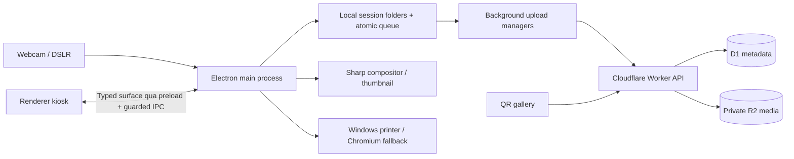

# Kiến trúc Chạm Photobooth

## Mục tiêu

Hệ thống ưu tiên lưu ảnh an toàn tại máy kiosk trước, cho phép chụp và in khi mất mạng, sau đó đồng bộ nền lên Cloudflare. Mã QR chỉ trỏ đến gallery riêng tư có thời hạn; R2 không public trực tiếp.

## Thành phần hiện tại

- Electron main quản lý camera bridge, file, render ảnh in, máy in, upload, cleanup và IPC.
- Renderer chạy sandbox (`contextIsolation: true`, `nodeIntegration: false`, `sandbox: true`) và không truy cập filesystem/secrets trực tiếp.
- `LocalStore` là nguồn sự thật offline của kiosk. Ảnh được ghi vào thư mục session ngay khi chụp; queue được ghi file tạm, `fsync`, rồi rename nguyên tử.
- `SharpCompositor` tạo ảnh thành phẩm độc lập với preview DOM và nhúng URL gallery/QR ở độ phân giải in.
- Upload Cloudflare R2 chạy nền, tuần tự, có checksum và có thể resume theo từng item.
- Website Vinext/React phục vụ gallery mobile-first. Worker xác thực upload secret, token QR, giới hạn MIME/kích thước, range video và security headers.
- D1 là nguồn sự thật cho lifecycle và metadata public. R2 chỉ giữ object media và `manifest.json` dự phòng/audit.

## Quyết định không rewrite

Kiosk hiện là JavaScript/Vite ổn định và có native C++ bridge. Chuyển toàn bộ sang React/TypeScript/SQLite trong một lần sẽ tăng rủi ro mất recovery hoặc gián đoạn máy in. Đợt này giữ ranh giới module hiện tại, bổ sung schema validation, workflow event, print history, retry policy và `fsync`.

Migration TypeScript + SQLite nên thực hiện theo kiểu strangler:

1. Khóa contract IPC bằng schema và test.
2. Thêm SQLite adapter song song, import idempotent từ `upload-queue.json`.
3. Chạy shadow-read/compare trên kiosk thử nghiệm.
4. Chỉ chuyển source of truth sau khi recovery và cleanup parity đạt 100%.

## Rủi ro còn lại

- Print provider vẫn nằm trong `main.js`; nên tách `PrinterProvider` và thêm mock/hardware smoke test.
- Queue local chưa phải SQLite nên query/report lớn không tối ưu; file JSON vẫn an toàn cho quy mô một kiosk nhưng cần theo dõi dung lượng.
- Rate limiting hiện dựa vào secret/token và giới hạn payload; production quy mô lớn nên thêm Cloudflare WAF/rate-limit rule theo route.
- Native C++ test cần đúng runtime DLL/toolchain trên Windows. Test JS có thể chạy độc lập nhưng test backend native sẽ fail nếu DLL thiếu.
